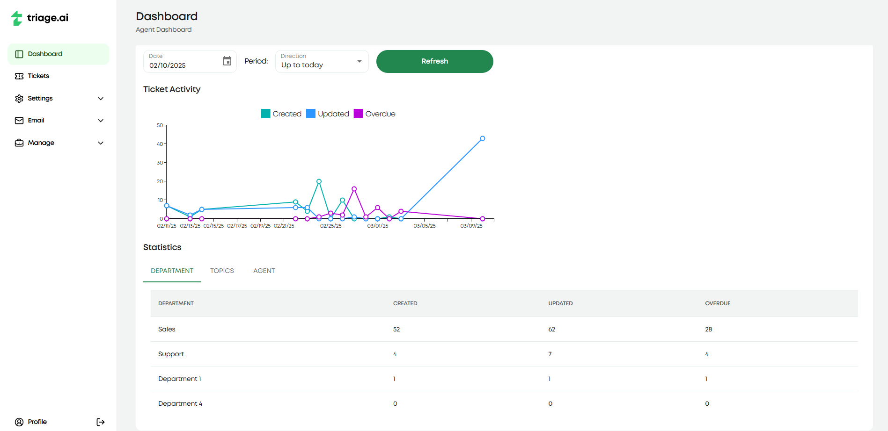

Dashboard Guide
=================

triage.ai offers a dashboard of helpful analytics to help you manage your support tickets more effectively. The dashboard lets agents review metrics that help understand ticket volume and activity
over a certain period, defaulted to a month. The dashboard currently tracks how many tickets are opened, marked overdue, and last edited on a specific date, with more helpful analytics soon to come.
This is broken up into a graph that displays these three metrics over the specified period and a table that breaks the ticket counts further down based on what departments/help topics exist, 
as well as a tab for the individual agent's tickets.

